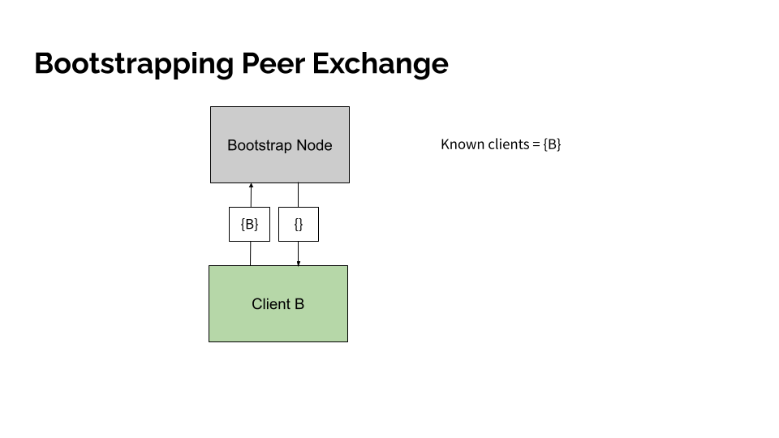
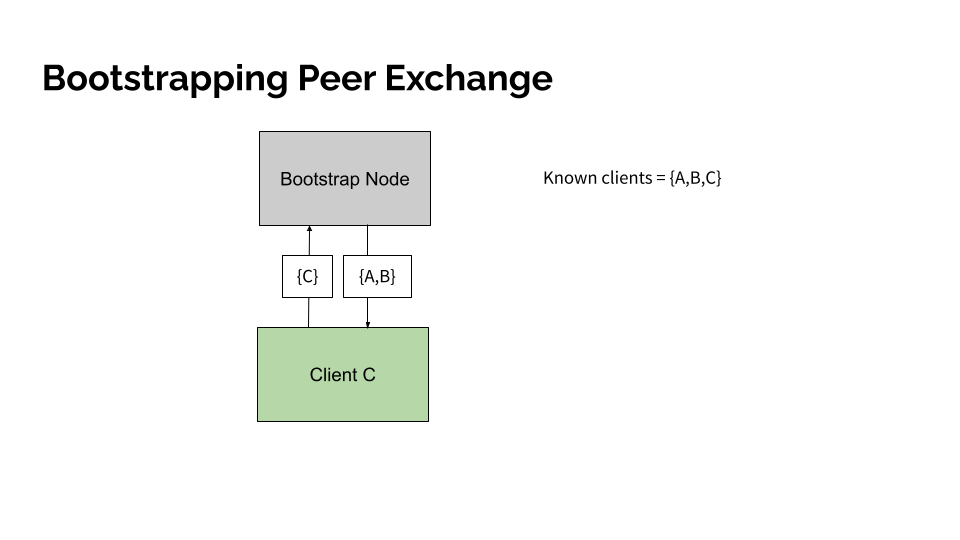
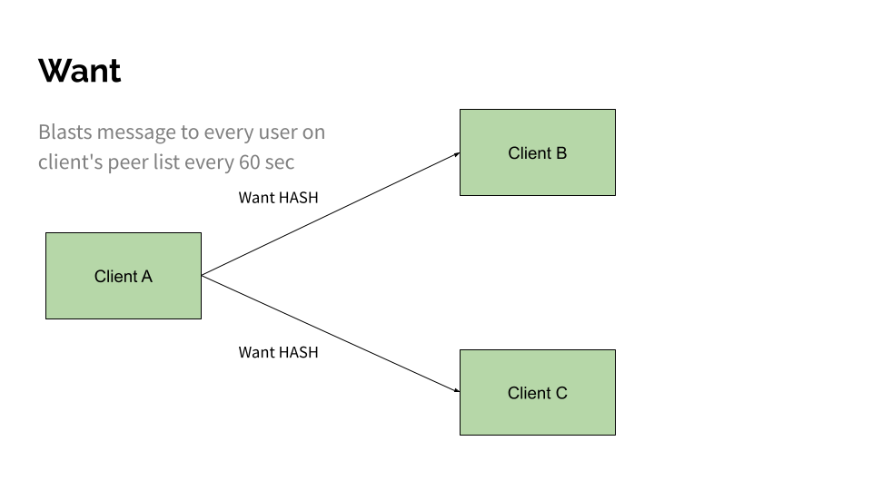
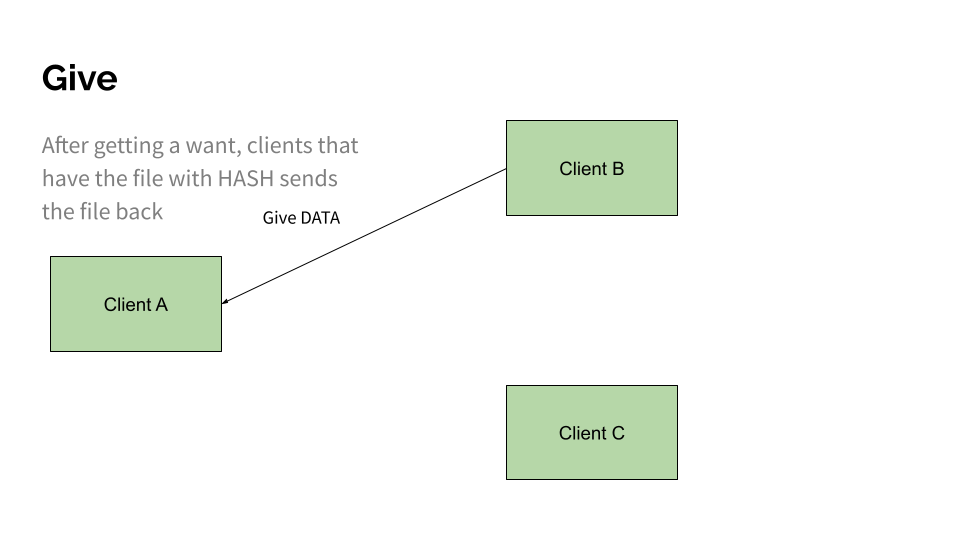

# P2P Networking

## Bootstrapping 
In this project, we implemented a simplified model of peer exchange, often refered to as PEX (https://en.wikipedia.org/wiki/Peer_exchange). The concept is frequently used in datastructures such as distributed hash tables (DHT) which are integral to modern bittorrent protocols that try to avoid a centralized point of failure that a tracker may provide. 

Peer exchange begins with a process known as "bootstrapping" where there are a few well known centralized nodes that clients intially first try to hit. As an example, the official libtorrent organization hosts a bootstrap node at dht.libtorrent.org:25401 (https://blog.libtorrent.org/2016/09/dht-bootstrap-node/). 

Below we provide an example of how boostrapping might be architected. 

<p align="center">
  
</p>
<p align="center">
  Client "A" connects to a known bootstrap node. The node records the client's IP/port and tells the client that it does not know anything yet. 
</p>


<p align="center">
  
</p>
<p align="center">
  Client "B" connects to a known bootstrap node. The node records the client's IP/port and returns the IP/port of client "A" that "B" can now   connect to. 
</p>

<p align="center">
  
</p>
<p align="center">
  Client "C" connects to a known bootstrap node. The node records the client's IP/port and returns the IP/port of client "A" and "B" that "C" can now connect to. 
</p>

## Peer Exchange 
After bootstrapping, clients engage in a process known as peer exchange where clients continuiously share the IP/port information of clients that they known about with other clients. You might realize that this is actually the same implementation as bootstrapping. In fact, all clients are actually completely valid bootstrapping servers themselves. 

## Message types 
Our client supports three types of message. An "ask" message where clients request a 1Mib piece by specifying a SHA256, a "give" message where clients send a 1Mib piece to another client, and a "peer" message, where clients send a list of IP/ports that they know about. We implemented message communication over TCP/IP socket connections. All messages are prefixed with the size of the message in bytes, stored as a uint32_t. 

Below we provide the exact layout of the messages for documentation reference (https://github.com/olincollege/p2p-networking/blob/main/src/message.h)

```C
// a struct for describing the info needed to address a peer
typedef struct peer_info {
  struct in6_addr sin6_addr; // 128 bit ipv6 adress
  in_port_t addr_port;       // uint16 for port number
} peer_info;
```

```C
typedef struct peer_message {
  uint32_t message_size; // sizeof(peer_message) - 4
  uint8_t type;          // should be set to 2
  peer_info peers[];     // flexible size
} peer_messa
```
<p align="center">
  
</p>

```C
// a struct for describing the info needed to ask for a 1MB piece
typedef struct ask_message {
  uint32_t message_size; // sizeof(ask_message) - 4
  uint8_t type;          // should be set to 0
  uint64_t sha256[4];
} ask_message;
```
<p align="center">
  
</p>

```C
// a struct for describing the info needed to send a 1MB piece
typedef struct give_message {
  uint32_t message_size; // sizeof(give_message) - 4
  uint8_t type;          // should be set to 1
  uint64_t sha256[4];
  uint8_t piece[PIECE_SIZE_BYTES]; // 1 MiB
} give_message;
```
<p align="center">
  
</p>


